# FSM — Task Roadmap (Story Level)

**Start:** April 1, 2026 · **Go-Live:** November 28, 2026
**Team:** Dev A · Dev B · 2 Full-Stack Developers
**Stack:** Next.js · TypeScript · shadcn/ui · Drizzle · PostgreSQL · React Native

---

## Visual Gantt (Story Level)

```mermaid
gantt
    title FSM Application — Story-Level Timeline
    dateFormat  YYYY-MM-DD
    axisFormat  %b %d

    section M1 · Foundation
    DB schema + RBAC middleware          :a11a, 2026-04-01, 7d
    Role hierarchy + stage/field access  :a11b, 2026-04-08, 7d
    Phone normalization + dup detection     :a801, 2026-04-08, 7d
    Fuzzy match + merge UI + rollback       :a802, 2026-04-15, 14d
    DB schema + kanban pipeline           :b2a,  2026-04-01, 10d
    Deal CRUD + 50 custom fields          :b2b,  2026-04-11, 10d
    Tags + loss reasons + auto-save       :b2c,  2026-04-21, 10d
    Gmail OAuth + WO detect + deal creation :b803, 2026-04-22, 10d

    section M2 · People & Comms
    Invite flow + encrypted doc storage   :a6a,  2026-05-01, 10d
    Skills + commission + mobile setup    :a6b,  2026-05-11, 10d
    Payment terms + tax-exempt flag    :a9a,  2026-05-08, 8d
    W-9 + COI + expiration tracking   :a9b,  2026-05-16, 8d
    Validate + map + import messages/files :b121, 2026-05-04, 7d
    Chats + channels + calls + recording   :b122, 2026-05-11, 8d
    User mgmt + groups + retention         :b123, 2026-05-19, 5d
    Platinum pt2 finish                :b9p2, 2026-05-20, 10d

    section M3 · Telephony
    Inbound routing + popup + auto-save     :a101, 2026-06-01, 10d
    Outbound + masking + Twilio Proxy       :a102, 2026-06-11, 8d
    2-way SMS + templates + TCPA opt-out    :a103, 2026-06-19, 8d
    Recording + hybrid storage + retention  :b104, 2026-06-01, 10d
    Missed calls dashboard + notifications  :b105, 2026-06-11, 7d
    Transfer + hold + conference + log      :b106, 2026-06-18, 8d
    Background GPS prototype          :b403p,2026-06-16, 14d

    section M4 · Dispatch & Mobile
    Google Maps + red pins + Realtime sub   :a401a, 2026-07-01, 7d
    Filtering + sidebar + stale indicator   :a401b, 2026-07-08, 7d
    Skills + metro filter + inventory check :a402a, 2026-07-15, 9d
    One-click assign + drag-drop reorder    :a402b, 2026-07-24, 9d
    GPS backend (DB + REST + Realtime)      :b403a, 2026-07-01, 8d
    Mobile UI — job list + status flow      :b403b, 2026-07-09, 8d
    GPS iOS + Android foreground service    :b403c, 2026-07-17, 8d
    Navigation + push notifications         :b403d, 2026-07-17, 8d
    Offline mode + sync queue + conflict    :b403e, 2026-07-25, 8d
    WO upload + registry + PDF         :b9fin, 2026-07-20, 12d

    section M5 · Finance
    3-tier pricing model + estimate builder :a3a, 2026-08-01, 10d
    Invoice form + tax by state + e-sign    :a3b, 2026-08-11, 10d
    Puppeteer PDF + late fee line items     :a3c, 2026-08-21, 10d
    Stripe config + webhook endpoint + keys  :b10a, 2026-08-01, 5d
    Stripe invoice template + e-sign link    :b10b, 2026-08-06, 8d
    3.5% service fee auto-calculation        :b10c, 2026-08-14, 5d
    Payment method selector + Stripe webhooks:b10x, 2026-08-19, 12d

    section M6 · Payments
    Full + partial refunds + chargeback      :a104, 2026-09-01, 8d
    Late fees cron + state config            :a105, 2026-09-09, 5d
    Sunbit $1k+ — initiation + webhook + UI :a106, 2026-09-14, 7d
    Data migration script (Workiz → new system)    :mig,  2026-09-14, 14d
    Tap to Pay — NFC + Stripe Terminal SDK  :b107, 2026-09-01, 8d
    Payments: ACH + cash/check + audit trail       :b10y, 2026-09-09, 12d
    All Stripe webhooks + deal status sync         :b10z, 2026-09-21, 10d

    section M7 · Inventory & Analytics
    Product catalog + SKU + barcode + CSV    :a501, 2026-10-01, 8d
    Warehouse + containers + stock dashboard :a502, 2026-10-09, 5d
    Receiving stock + barcode + signature    :a503, 2026-10-14, 5d
    Transfer orders (3 types) + barcode      :a504, 2026-10-19, 5d
    Deal integration — scan → deduct         :a505, 2026-10-24, 4d
    Stocktaking + variance + approval        :a506, 2026-10-28, 8d
    Commission report engine               :b7a,  2026-10-01, 10d
    Performance + financial dashboards     :b7b,  2026-10-11, 8d
    Payment + inventory + jobs reports     :b7c,  2026-10-19, 7d
    Custom report builder                  :b7d,  2026-10-26, 7d

    section M8 · QA & Launch
    E2E smoke tests (call→deal→assign→invoice→pay) :qa1,  2026-11-01, 7d
    Security audit + DB indexes + query tuning     :qa2,  2026-11-01, 7d
    Staging deploy (Vercel + Supabase/Railway)     :qa3,  2026-11-08, 3d
    Pilot — 2-3 dispatchers + 2-3 techs            :pilot,2026-11-10, 14d
    Fix UX bugs from pilot                         :qa4,  2026-11-17, 7d
    Data migration validate + dry-run              :mig2, 2026-11-17, 7d
    Production deploy + SSL + Sentry + backups     :prod, 2026-11-24, 4d
    🚀 Go-Live                                     :milestone, live, 2026-11-28, 1d
```

---

## Month 1 — Foundation (Apr 1 – Apr 30) · 55 SP

### Week 1 · Apr 1–7

| Dev       | Task                                                                          | Output           |
| --------- | ----------------------------------------------------------------------------- | ---------------- |
| **Dev A** | EPIC-11: DB schema — `roles`, `permissions`, `user_roles` tables + migrations | Schema merged    |
| **Dev A** | EPIC-11: RBAC middleware — route-level guard, JWT role claim                  | Middleware live  |
| **Dev B** | EPIC-2: DB schema — deals, stages, custom fields (50+), tags, loss reasons    | Schema merged    |
| **Dev B** | EPIC-2: Kanban pipeline UI — drag-and-drop columns, stage transitions         | Pipeline renders |

### Week 2 · Apr 8–14

| Dev       | Task                                                                         | Output             |
| --------- | ---------------------------------------------------------------------------- | ------------------ |
| **Dev A** | EPIC-11: 5-tier role hierarchy (Owner → Dispatcher → Tech → Client → Guest)  | Roles configurable |
| **Dev A** | EPIC-11: Stage-level access + field-level permissions scaffold               | Permissions hook   |
| **Dev A** | 8.01: Phone normalization to E.164 + duplicate detection on inbound          | Dedup on inbound   |
| **Dev B** | EPIC-2: Deal CRUD — create, edit, delete, 50 custom fields, field validation | Deal form live     |
| **Dev B** | EPIC-2: Deal search, filtering by tags/stage/assignee                        | Filters live       |

### Week 3 · Apr 15–21

| Dev       | Task                                                                     | Output           |
| --------- | ------------------------------------------------------------------------ | ---------------- |
| **Dev A** | 8.02: Fuzzy matching algorithm (Levenshtein + phone/email normalization) | Match engine     |
| **Dev A** | 8.02: Manual merge UI — side-by-side diff, field selection               | Merge modal      |
| **Dev B** | EPIC-2: Loss reasons config + tag system (create, assign, filter)        | Tags + loss live |
| **Dev B** | EPIC-2: Auto-save draft every 5 sec + optimistic UI updates              | Auto-save live   |

### Week 4 · Apr 22–30

| Dev       | Task                                                       | Output          |
| --------- | ---------------------------------------------------------- | --------------- |
| **Dev A** | 8.02: 30-day rollback for merged clients + audit log       | Rollback live   |
| **Dev B** | 8.03: Gmail OAuth integration + WO email detection         | Gmail connected |
| **Dev B** | 8.03: Auto deal creation from WO email attachment + parser | Deal from email |

> **Milestone M1 (Apr 30):** Dispatcher logs in, creates a deal, moves it through the pipeline, filters by tags. CRM client lookup + deduplication live.

---

## Month 2 — People & Comms (May 1 – May 31) · 40 SP

### Week 1 · May 1–7

| Dev       | Task                                                                      | Output          |
| --------- | ------------------------------------------------------------------------- | --------------- |
| **Dev A** | EPIC-6: Admin invite flow — create account, email invite, self-fill form  | Invite sends    |
| **Dev A** | EPIC-6: Encrypted document storage — DL, SSN, bank info (AES-256 at rest) | Docs upload     |
| **Dev B** | 12.01: Validate Flock/WhatsApp export format, map users to new accounts   | Mapping ready   |
| **Dev B** | 12.01: Import messages + files, preserve timestamps                       | Import complete |

### Week 2 · May 8–14

| Dev       | Task                                                                           | Output              |
| --------- | ------------------------------------------------------------------------------ | ------------------- |
| **Dev A** | EPIC-6: Skill approval workflow — skill request, manager review, approval/deny | Skills configurable |
| **Dev A** | EPIC-9pt1: Payment terms — Net-15/30/60/custom per Platinum client             | Terms live          |
| **Dev B** | 12.02: Private chats + group chats + department channels                       | Chats live          |
| **Dev B** | 12.02: File sharing + audio/video calling + recording                          | Calls live          |

### Week 3 · May 15–21

| Dev       | Task                                                       | Output            |
| --------- | ---------------------------------------------------------- | ----------------- |
| **Dev A** | EPIC-6: Commission rate config per technician              | Commission config |
| **Dev A** | EPIC-6: Mobile app setup guide + initial SSO config        | App setup guide   |
| **Dev A** | EPIC-9pt1: Tax-exempt flag + W-9 / COI document storage    | Docs stored       |
| **Dev B** | 12.03: User management, group creation, retention policies | Admin panel live  |
| **Dev B** | EPIC-9pt2: Platinum client card — part 2 start             | Card in progress  |

### Week 4 · May 22–31

| Dev       | Task                                                       | Output        |
| --------- | ---------------------------------------------------------- | ------------- |
| **Dev A** | EPIC-9pt1: COI expiration tracking + renewal notifications | Expiry alerts |
| **Dev B** | EPIC-9pt2: Platinum client finish                          | Card complete |

> **Milestone M2 (May 31):** Technicians onboarded via full workflow. Platinum client cards configured. Team messenger migrated and live.

---

## Month 3 — Telephony (Jun 1 – Jun 30) · 42 SP

### Week 1 · Jun 1–7

| Dev       | Task                                                                        | Output          |
| --------- | --------------------------------------------------------------------------- | --------------- |
| **Dev A** | 1.01: Twilio inbound routing — distribute to all dispatchers simultaneously | Calls ring all  |
| **Dev A** | 1.01: Popup card — client info + recent deals on inbound                    | Popup shows     |
| **Dev B** | 1.04: 100% auto-recording via Twilio                                        | Recording works |
| **Dev B** | 1.04: Hybrid storage — 90-day hot (S3) + 7-year cold archive                | Storage live    |

### Week 2 · Jun 8–14

| Dev       | Task                                                             | Output         |
| --------- | ---------------------------------------------------------------- | -------------- |
| **Dev A** | 1.01: Round-robin queue + deal draft auto-save every 5 sec       | Queue live     |
| **Dev A** | 1.02: Outbound via Twilio Proxy — client sees company number     | Masking works  |
| **Dev B** | 1.04: Whisper mode + AI transcription scaffold (optional toggle) | Whisper live   |
| **Dev B** | 1.05: Missed calls real-time dashboard + push notifications      | Dashboard live |

### Week 3 · Jun 15–21

| Dev       | Task                                                                        | Output        |
| --------- | --------------------------------------------------------------------------- | ------------- |
| **Dev A** | 1.02: Callback routing through dispatcher + metro area caller IDs           | Routing live  |
| **Dev A** | 1.03: 2-way SMS via Twilio + templates with placeholders                    | SMS live      |
| **Dev B** | 1.05: One-click callback + auto-draft for unknown numbers + bulk actions    | Callback live |
| **Dev B** | 1.06: Warm/cold transfer + hold + conference                                | Transfer live |
| **Dev B** | **4.03-PROTO: Start background GPS prototype (Android foreground service)** | Proto running |

### Week 4 · Jun 22–30

| Dev       | Task                                                                           | Output          |
| --------- | ------------------------------------------------------------------------------ | --------------- |
| **Dev A** | 1.03: Inbound SMS creates Lead for unknown number + TCPA opt-out               | Opt-out live    |
| **Dev B** | 1.06: Call tagging (Spam, Wrong Number) + advanced log + disposition codes     | Tags + log live |
| **Dev B** | **4.03-PROTO: Validate Android GPS survives background kill → decision point** | Go/No-Go        |

> **Decision point (Jun 28):** If Android foreground service GPS works → proceed with React Native. If blocked → evaluate Bitrix24 Mobile SDK.
>
> **Milestone M3 (Jun 30):** Dispatcher receives inbound calls with client popup, sends SMS, sees missed calls dashboard, listens to recordings.

---

## Month 4 — Dispatch Map · Mobile App · GPS (Jul 1 – Jul 31) · 46 SP

### Week 1 · Jul 1–7

| Dev       | Task                                                                             | Output      |
| --------- | -------------------------------------------------------------------------------- | ----------- |
| **Dev A** | 4.01: Google Maps JS API integration + red pins for unassigned jobs              | Map renders |
| **Dev A** | 4.01: Color-coded technician icons with sequence badges [1][2][3]                | Icons live  |
| **Dev B** | 4.03: GPS backend — `technician_location` + `technician_location_history` tables | DB ready    |
| **Dev B** | 4.03: REST endpoints — `POST /location/start`, `/update`, `/stop`                | API live    |

### Week 2 · Jul 8–14

| Dev       | Task                                                                                  | Output         |
| --------- | ------------------------------------------------------------------------------------- | -------------- |
| **Dev A** | 4.01: Supabase Realtime subscription for GPS updates + 30-sec polling fallback        | Real-time map  |
| **Dev A** | 4.01: Filtering (job type/area/status) + job details sidebar + stale indicator >5 min | Filters live   |
| **Dev B** | 4.03: Supabase Realtime broadcast on each location write                              | Broadcast live |
| **Dev B** | 4.03: Mobile UI — job list with sequence numbers, "NEXT" in red                       | UI renders     |

### Week 3 · Jul 15–23

| Dev       | Task                                                                                     | Output           |
| --------- | ---------------------------------------------------------------------------------------- | ---------------- |
| **Dev A** | 4.02: Skills + metro area filter (required) + inventory check (warning)                  | Filter engine    |
| **Dev A** | 4.02: Top-5 recommended techs sort by current job count                                  | Recommendation   |
| **Dev B** | 4.03: Accept → In Progress → Complete status flow + expanded job card                    | Status flow live |
| **Dev B** | 4.03: GPS iOS — `react-native-background-geolocation`, 30s/50m, `stopOnTerminate: false` | iOS GPS live     |
| **Dev B** | 4.03: GPS Android — `react-native-foreground-service` + persistent notification          | Android GPS live |

### Week 4 · Jul 24–31

| Dev       | Task                                                                            | Output           |
| --------- | ------------------------------------------------------------------------------- | ---------------- |
| **Dev A** | 4.02: One-click assign + drag-drop reorder + [Show All] override                | Assignment live  |
| **Dev A** | 4.02: Creates `b_deal_assignment` record on assign                              | Record saved     |
| **Dev B** | 4.03: [Navigate] deep-link to Maps/Apple Maps/Waze + push notifications         | Nav + push live  |
| **Dev B** | 4.03: Offline mode — cache jobs, queue 100 updates, auto-sync + conflict dialog | Offline works    |
| **Dev B** | EPIC-9fin: WO upload + metadata extraction + Work Order registry + PDF delivery | WO registry live |

> **Milestone M4 (Jul 31):** Dispatcher sees technician locations update live on the map. Techs accept, start, and complete jobs from phones. Job sequence numbers re-calculate automatically.

---

## Month 5 — Invoicing · Stripe Core (Aug 1 – Aug 31) · 46 SP

> **Pre-requisite:** Approve invoice template design before Aug 1 starts.

### Week 1 · Aug 1–7

| Dev       | Task                                                                   | Output           |
| --------- | ---------------------------------------------------------------------- | ---------------- |
| **Dev A** | EPIC-3: 3-tier pricing model (Cost Company / Cost Tech / Client Price) | Pricing engine   |
| **Dev A** | EPIC-3: Estimate builder UI — line items, quantities, discounts        | Estimates live   |
| **Dev B** | 10.01: Stripe account config + webhook endpoint + API key management   | Stripe connected |
| **Dev B** | 10.02: Stripe invoice template setup                                   | Template ready   |

### Week 2 · Aug 8–14

| Dev       | Task                                                                     | Output            |
| --------- | ------------------------------------------------------------------------ | ----------------- |
| **Dev A** | EPIC-3: Invoice form — convert estimate to invoice, edit line items      | Invoice form live |
| **Dev A** | EPIC-3: Tax calculation by state/metro                                   | Tax calculates    |
| **Dev B** | 10.02: E-signature flow (`signature_pad`) + mobile-friendly payment link | E-sign live       |
| **Dev B** | 10.03: 3.5% service fee auto-calculation on card payments only           | Fee auto-adds     |

### Week 3 · Aug 15–21

| Dev       | Task                                                                  | Output          |
| --------- | --------------------------------------------------------------------- | --------------- |
| **Dev A** | EPIC-3: Digital signature integration on invoice                      | Signature works |
| **Dev A** | EPIC-3: Puppeteer branded PDF generation                              | PDF generates   |
| **Dev B** | Payment method selector UI (card / ACH / cash / check / Sunbit)       | Selector live   |
| **Dev B** | Stripe `payment_intent.succeeded` + `charge.dispute.created` webhooks | Webhooks live   |

### Week 4 · Aug 22–31

| Dev       | Task                                                   | Output          |
| --------- | ------------------------------------------------------ | --------------- |
| **Dev A** | EPIC-3: Late fee line items on overdue invoices        | Late fees added |
| **Dev B** | `refund.created` webhook + deal status sync on payment | Status syncs    |

> **Milestone M5 (Aug 31):** Dispatcher creates estimate → converts to invoice → client signs online → pays by card with automatic service fee applied.

---

## Month 6 — Payments Complete (Sep 1 – Sep 30) · 39 SP

> **Also this month:** Write data migration script (Workiz → new system). Do not defer to M8.

### Week 1 · Sep 1–7

| Dev       | Task                                                                   | Output          |
| --------- | ---------------------------------------------------------------------- | --------------- |
| **Dev A** | 10.04: Full + partial refunds via Stripe API                           | Refunds live    |
| **Dev A** | 10.04: Chargeback workflow + evidence upload + dispute status tracking | Disputes live   |
| **Dev B** | 10.07: Stripe Terminal SDK integration + hardware pairing flow         | Terminal paired |
| **Dev B** | 10.07: NFC Tap to Pay on iOS + Android                                 | Tap to Pay live |

### Week 2 · Sep 8–14

| Dev       | Task                                                               | Output            |
| --------- | ------------------------------------------------------------------ | ----------------- |
| **Dev A** | 10.05: Daily cron job for late fees + configurable % by state      | Cron live         |
| **Dev A** | 10.05: Auto-append late fee line item to overdue invoices          | Line item appends |
| **Dev B** | ACH payment flow + record + deal status update                     | ACH live          |
| **Dev B** | Cash/check recording + audit trail                                 | Cash/check live   |
| **Both**  | Start data migration script — export Workiz clients + deal history | Script started    |

### Week 3 · Sep 15–21

| Dev       | Task                                                                | Output            |
| --------- | ------------------------------------------------------------------- | ----------------- |
| **Dev A** | 10.06: Sunbit installment plan initiation for jobs $1,000+          | Initiation live   |
| **Dev A** | 10.06: Sunbit approval/denial webhook + UI status flow              | Webhook live      |
| **Dev B** | All remaining Stripe webhooks (`payment_intent.succeeded` variants) | Webhooks complete |
| **Dev B** | Full deal status sync on every payment event                        | Sync live         |
| **Both**  | Data migration: validate data quality + map Workiz fields           | Mapping complete  |

### Week 4 · Sep 22–30

| Dev      | Task                                                                     | Output         |
| -------- | ------------------------------------------------------------------------ | -------------- |
| **Both** | Data migration: dry-run on staging — validate record counts, check nulls | Dry-run passes |

> **Milestone M6 (Sep 30):** All payment methods live. Refunds, disputes, Sunbit, Tap to Pay work end-to-end.

---

## Month 7 — Inventory · Analytics (Oct 1 – Oct 31) · 52 SP

> Highest SP month. Identify blockers by Oct 14 (W2) — escalate immediately if behind.

### Week 1 · Oct 1–8

| Dev       | Task                                                                      | Output            |
| --------- | ------------------------------------------------------------------------- | ----------------- |
| **Dev A** | 5.01: Products vs Services catalogs + hierarchical categories             | Catalog live      |
| **Dev A** | 5.01: SKU/barcode fields + 3-tier pricing + supplier mapping              | SKU/barcode live  |
| **Dev B** | EPIC-7: Commission engine — `(Total − Tax − Parts − CC fee) × tech_rate%` | Engine calculates |
| **Dev B** | EPIC-7: Date / tech / job-type filters + row-by-row breakdown             | Filters live      |

### Week 2 · Oct 9–14

| Dev       | Task                                                       | Output           |
| --------- | ---------------------------------------------------------- | ---------------- |
| **Dev A** | 5.01: Bulk CSV import + min stock levels                   | CSV import works |
| **Dev A** | 5.02: Central warehouse + technician containers setup      | Containers live  |
| **Dev A** | 5.02: Real-time stock dashboard + role-based visibility    | Dashboard live   |
| **Dev B** | EPIC-7: Revenue dashboards + technician utilization charts | Dashboards live  |
| **Dev B** | EPIC-7: Source effectiveness + deal funnel charts          | Funnel live      |

### Week 3 · Oct 15–21

| Dev       | Task                                                                          | Output         |
| --------- | ----------------------------------------------------------------------------- | -------------- |
| **Dev A** | 5.03: Receiving stock — barcode scanning primary + warehouse/container option | Receiving live |
| **Dev A** | 5.03: Confirmation workflow + receipt with signature                          | Receipt live   |
| **Dev A** | 5.04: 3 transfer types (W→C, C→W, C→C) + barcode-driven workflow              | Transfers live |
| **Dev B** | EPIC-7: Payment report + inventory usage report + jobs master report          | Reports live   |
| **Dev B** | EPIC-7: Advanced filters + column selection + CSV/Excel export                | Export live    |

### Week 4 · Oct 22–31

| Dev       | Task                                                                         | Output           |
| --------- | ---------------------------------------------------------------------------- | ---------------- |
| **Dev A** | 5.04: Draft → Pending → Completed states + audit trail                       | States live      |
| **Dev A** | 5.05: Deal integration — scan barcode → check container → deduct immediately | Scan-to-deduct   |
| **Dev A** | 5.06: Stocktaking — blind count + manager-initiated freeze + variance report | Stocktaking live |
| **Dev A** | 5.06: Threshold alerts + manager approval + technician history log           | Alerts live      |
| **Dev B** | EPIC-7: Custom report builder — field selection + filter config + save/share | Builder live     |

> **Milestone M7 (Oct 31):** Technicians manage van inventory from mobile app. Managers see commission breakdowns and export reports.

---

## Month 8 — QA & Production Launch (Nov 1 – Nov 28)

### Week 1 · Nov 1–7 — Testing

| Owner    | Task                                                                                               |
| -------- | -------------------------------------------------------------------------------------------------- |
| **Both** | E2E smoke: inbound call → deal → assign tech → invoice → payment → commission report               |
| **Both** | GPS smoke: clock-in → location on map → updates every 30s → stale after 5 min → stops on clock-out |
| **Both** | Mobile smoke: job list loads → Accept→InProgress→Done syncs to Deal → offline queue flushes        |
| **Both** | Android GPS: survives screen lock, battery optimizer kill, app swipe-away                          |
| **Both** | Security audit: SQL injection, auth bypass, CORS policy, rate limiting, input validation           |
| **Both** | Performance: optimize commission report + jobs report on large datasets + add DB indexes           |

### Week 2 · Nov 8–9 — Staging Deploy

| Owner    | Task                                           |
| -------- | ---------------------------------------------- |
| **Both** | Deploy to staging: Vercel + Supabase / Railway |
| **Both** | Smoke test all flows on staging environment    |

### Weeks 2–3 · Nov 10–23 — Pilot

| Owner    | Task                                                                               |
| -------- | ---------------------------------------------------------------------------------- |
| **Both** | Pilot with 2–3 dispatchers + 2–3 technicians using staging in parallel with Workiz |
| **Both** | Collect UX issues, log bugs, prioritize critical fixes                             |
| **Both** | Fix UX issues and bugs surfaced during pilot                                       |
| **Both** | Finalize data migration script — validate + run against staging                    |

### Week 4 · Nov 24–28 — Go-Live

| Owner    | Task                                                         |
| -------- | ------------------------------------------------------------ |
| **Both** | Production deploy: custom domain + SSL + production env vars |
| **Both** | Monitoring setup: Sentry + uptime alerts + Stripe dashboard  |
| **Both** | Automated daily DB backup                                    |
| **Both** | Workiz cutover — team switches fully to the new system       |
| **Both** | Post-launch bug triage + admin & role-specific user guides   |

> **Milestone M8 (Nov 28): 🚀 System is live. Workiz is decommissioned.**

---

## Milestone Summary

| #   | Date   | Milestone                                                  |
| --- | ------ | ---------------------------------------------------------- |
| M1  | Apr 30 | Deal pipeline + CRM live                                   |
| M2  | May 31 | Techs onboarded · Platinum configured · Messenger migrated |
| M3  | Jun 30 | Full telephony live                                        |
| M4  | Jul 31 | Dispatch map + mobile app + live GPS tracking              |
| M5  | Aug 31 | Invoicing + Stripe payments live                           |
| M6  | Sep 30 | All payment methods live (refunds, Sunbit, Tap to Pay)     |
| M7  | Oct 31 | Inventory + commission reports live                        |
| M8  | Nov 28 | 🚀 Production go-live · Workiz decommissioned              |

---

## Critical Decision Points

| Date       | Decision                                            | If YES                    | If NO                                     |
| ---------- | --------------------------------------------------- | ------------------------- | ----------------------------------------- |
| **Jun 28** | Android background GPS works in React Native?       | Proceed with React Native | Evaluate Bitrix24 SDK fallback            |
| **Jul 31** | Supabase Realtime stable with 20+ concurrent techs? | Keep Realtime as primary  | Enable 30-sec polling as default          |
| **Oct 14** | M7 on track (no >3d slippage)?                      | Continue                  | Escalate, scope-cut Custom Report Builder |
| **Nov 10** | Pilot feedback critical-bug count < 5?              | Proceed to prod deploy    | Extend pilot by 1 week                    |

---

## Post-Launch Backlog (Out of Scope v1)

| Item                                       | Source  | Priority |
| ------------------------------------------ | ------- | -------- |
| AI transcription for call recordings       | EPIC-1  | Medium   |
| Google Calendar integration for scheduling | EPIC-4  | High     |
| Custom Report Builder (advanced queries)   | EPIC-7  | Medium   |
| Sunbit for jobs under $1,000               | EPIC-10 | Low      |
| Serial number tracking for tools           | EPIC-5  | Low      |
| Field-level permissions enforcement (full) | EPIC-11 | High     |
