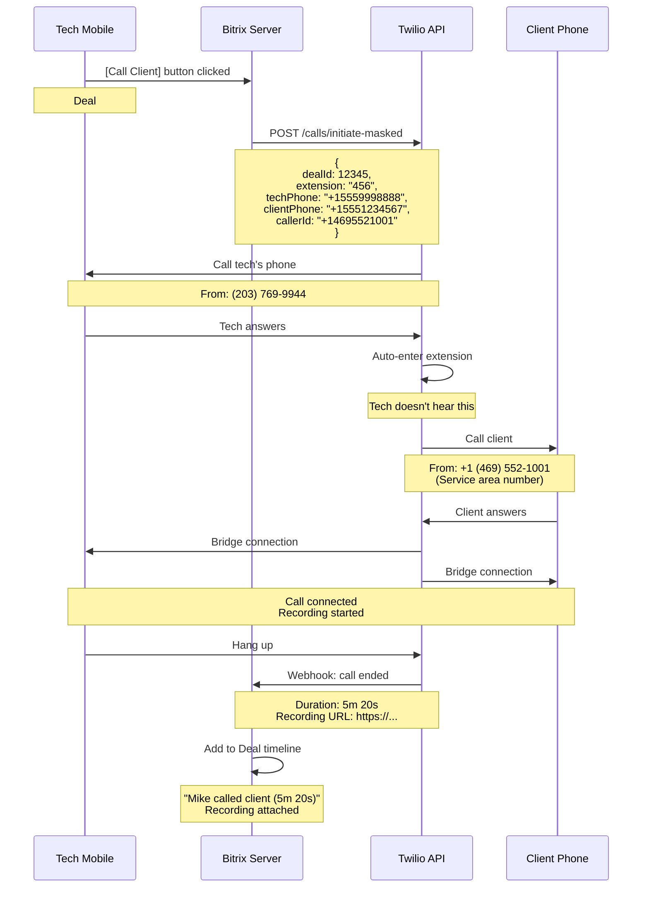

# TR-02: Telephony - Outbound Calls & Masking

**Epic:** IP Telephony Integration
**Component:** Outbound Call Handling & Number Masking
**Version:** 1.0
**Last Updated:** October 6, 2025

---

## 1. System Overview

### 1.1. Types of Outbound Calls

| Who calls | Whom | Caller ID (what client sees) | Privacy |
|--------------|------|------------------------------|---------|
| **Dispatcher** → Client | From Deal or Call Log | Original company number (the one client called) | ❌ No masking (dispatcher sees client number) |
| **Technician** → Client | From Deal through masking system | Company number for client's service area | ✅ Masking enabled (tech does NOT see client number) |
| **Client** → Technician callback | Calls number seen from tech | Company number | ✅ Call goes through dispatchers (not directly to tech) |

### 1.2. Key Principles

**Privacy:**
- ✅ Technician **does NOT have access** to client's personal number
- ✅ Client **does NOT have access** to technician's personal number
- ✅ All communications through company numbers

**Caller ID Logic:**
- Client **always sees company number** for their service area
- If client has multiple Deals with different Job Sources → each Deal has its original number
- Example:
  ```
  Deal #100: Client called +1 (469) 552-1000 (Texas Google Ads)
    → Dispatcher calls back → Client sees: +1 (469) 552-1000

  Deal #200: Same client called +1 (469) 552-2000 (Texas Facebook Ads)
    → Dispatcher calls back → Client sees: +1 (469) 552-2000
  ```

**Routing Logic:**
- When client calls company number → **always reaches dispatchers**
- Dispatchers can manually transfer call to technician (if needed)

---

## 2. Service Area Numbers (Company Numbers by Regions)

### 2.1. Number Structure

**6 states × 2 client types = 12 company numbers**

| State | Regular Clients | Platinum Clients | Area Code |
|-------|----------------|------------------|-----------|
| **Texas** | +1 (469) 552-1001 | +1 (469) 552-2001 | 469 (Dallas) |
| **Alabama** | +1 (256) 388-1001 | +1 (256) 388-2001 | 256 |
| **Connecticut** | +1 (203) 717-1001 | +1 (203) 717-2001 | 203 |
| **Illinois** | +1 (847) 792-1001 | +1 (847) 792-2001 | 847 (Chicago suburbs) |
| **Arizona** | +1 (623) 343-1001 | +1 (623) 343-2001 | 623 (Phoenix) |
| **New York** | +1 (XXX) XXX-1001 | +1 (XXX) XXX-2001 | TBD |

**Purpose:**
- **Regular**: For regular clients (Google Ads, Facebook, Referrals)
- **Platinum**: For corporate/government clients (different payment terms, special SLA)

### 2.2. How Service Area Number is Determined

**When Deal is created:**

```
Deal is created → system automatically sets:

  UF_CRM_SERVICE_AREA_NUMBER = [number from table above]

  Based on:
    1. Client Type (Regular / Platinum)
    2. Service Area (State)
```

**Bitrix Custom Fields:**

```
Field 1: Service Area Number
Code: UF_CRM_SERVICE_AREA_NUMBER
Type: Phone
Description: Default company number for this service area + client type
Auto-filled: Yes (based on Service Area + Client Type)
Editable: No (read-only)
Usage: For technician masked calls (Caller ID shown to client)

Field 2: Called Number (Original)
Code: UF_CRM_CALLED_NUMBER
Type: Phone
Description: Actual company number client called when creating this Deal
Auto-filled: Yes (from inbound call metadata)
Editable: No (read-only)
Usage: For dispatcher callbacks (client sees familiar number)
```

**Difference between fields:**

| Field | Source | Usage |
|------|---------|--------------|
| `UF_CRM_SERVICE_AREA_NUMBER` | Auto-generated by Service Area + Client Type | Tech calls client → Client sees this number |
| `UF_CRM_CALLED_NUMBER` | From inbound call metadata | Dispatcher calls back → Client sees the number they called |

**Example:**
```
Client called: +1 (469) 552-1000 (Google Ads campaign number)
  ↓
Deal is created:
  - UF_CRM_CALLED_NUMBER = +1 (469) 552-1000  (original is saved)
  - UF_CRM_SERVICE_AREA_NUMBER = +1 (469) 552-1001  (default for Texas Regular)

Dispatcher callback: uses +1 (469) 552-1000 (original)
Tech masked call: uses +1 (469) 552-1001 (default service area)
```

**Mapping Logic (PHP):**

```php
// File: /local/php_interface/include/service_area_mapping.php

class ServiceAreaNumberMapping {

    private static $mapping = [
        'Texas' => [
            'Regular' => '+14695521001',
            'Platinum' => '+14695522001'
        ],
        'Alabama' => [
            'Regular' => '+12563881001',
            'Platinum' => '+12563882001'
        ],
        'Connecticut' => [
            'Regular' => '+12037171001',
            'Platinum' => '+12037172001'
        ],
        'Illinois' => [
            'Regular' => '+18477921001',
            'Platinum' => '+18477922001'
        ],
        'Arizona' => [
            'Regular' => '+16233431001',
            'Platinum' => '+16233432001'
        ],
        'New York' => [
            'Regular' => '+1XXX5551001',  // TBD
            'Platinum' => '+1XXX5552001'
        ]
    ];

    /**
     * Get company number for service area + client type
     */
    public static function getNumberForDeal($serviceArea, $clientType) {
        return self::$mapping[$serviceArea][$clientType] ?? null;
    }

    /**
     * Auto-fill when Deal is created
     */
    public static function autoFillServiceAreaNumber($dealId) {
        $deal = \CCrmDeal::GetByID($dealId);

        $serviceArea = $deal['UF_CRM_SERVICE_AREA'];    // "Texas"
        $clientType = $deal['UF_CRM_CLIENT_TYPE'];      // "Regular" or "Platinum"

        $number = self::getNumberForDeal($serviceArea, $clientType);

        if ($number) {
            \CCrmDeal::Update($dealId, [
                'UF_CRM_SERVICE_AREA_NUMBER' => $number
            ]);
        }
    }
}

// Event handler
EventManager::getInstance()->addEventHandler(
    'crm',
    'OnAfterCrmDealAdd',
    function($arFields) {
        ServiceAreaNumberMapping::autoFillServiceAreaNumber($arFields['ID']);
    }
);
```

---

## 3. Masking System (Technician Masking System)

### 3.1. Architecture

**One masking number + extensions for all Deals:**

```
Masking Number (base): +1 (203) 769-9944
Extensions: 001 - 999 (supports up to 999 simultaneously active Deals)

Each Deal receives a unique extension:
  Deal #12345 → Extension: #456
  Deal #12346 → Extension: #457
  Deal #12347 → Extension: #458
```

**Full masked number format:**
```
(203) 769-9944 #456
  ↑                ↑
  Base number      Extension
```

**Why extensions, not separate numbers:**
- ✅ **Cost:** $1.15/month (1 number) instead of $115/month (100 numbers)
- ✅ **Scalability:** Up to 999 extensions (unlimited for 100k deals/year)
- ✅ **Simplicity:** No need to manage number pool (assign/release)

### 3.2. Extension Generation

**Rules:**
- Extension = **3 digits** (001 - 999)
- Unique for each **active** Deal
- After Deal closes → extension is released (can be reused)

**Database Structure:**

```sql
CREATE TABLE b_crm_deal_extensions (
    ID INT PRIMARY KEY AUTO_INCREMENT,
    DEAL_ID INT NOT NULL,
    EXTENSION VARCHAR(3) NOT NULL,
    ASSIGNED_AT DATETIME NOT NULL,
    RELEASED_AT DATETIME NULL,
    STATUS ENUM('ACTIVE', 'RELEASED') DEFAULT 'ACTIVE',

    UNIQUE KEY uk_extension_active (EXTENSION, STATUS),
    INDEX idx_deal_id (DEAL_ID),
    INDEX idx_status (STATUS)
);
```

**Extension Assignment Logic:**

```php
// File: /local/php_interface/include/extension_manager.php

class ExtensionManager {

    /**
     * Assign extension for Deal
     */
    public static function assignExtension($dealId) {
        global $DB;

        // Check if extension already exists for this Deal
        $existing = $DB->Query("
            SELECT EXTENSION FROM b_crm_deal_extensions
            WHERE DEAL_ID = {$dealId} AND STATUS = 'ACTIVE'
        ")->Fetch();

        if ($existing) {
            return $existing['EXTENSION'];
        }

        // Find first available extension
        $usedExtensions = [];
        $result = $DB->Query("
            SELECT EXTENSION FROM b_crm_deal_extensions
            WHERE STATUS = 'ACTIVE'
        ");

        while ($row = $result->Fetch()) {
            $usedExtensions[] = (int)$row['EXTENSION'];
        }

        // Generate extension from 001 to 999
        for ($ext = 1; $ext <= 999; $ext++) {
            if (!in_array($ext, $usedExtensions)) {
                $extension = str_pad($ext, 3, '0', STR_PAD_LEFT); // "001", "045", "456"

                // Save to database
                $DB->Query("
                    INSERT INTO b_crm_deal_extensions (
                        DEAL_ID, EXTENSION, ASSIGNED_AT, STATUS
                    ) VALUES (
                        {$dealId},
                        '{$extension}',
                        NOW(),
                        'ACTIVE'
                    )
                ");

                return $extension;
            }
        }

        throw new \Exception('No available extensions (all 999 in use)');
    }

    /**
     * Release extension after Deal closes
     */
    public static function releaseExtension($dealId) {
        global $DB;

        $DB->Query("
            UPDATE b_crm_deal_extensions
            SET STATUS = 'RELEASED', RELEASED_AT = NOW()
            WHERE DEAL_ID = {$dealId} AND STATUS = 'ACTIVE'
        ");
    }

    /**
     * Get extension for Deal
     */
    public static function getExtension($dealId) {
        global $DB;

        $result = $DB->Query("
            SELECT EXTENSION FROM b_crm_deal_extensions
            WHERE DEAL_ID = {$dealId} AND STATUS = 'ACTIVE'
        ")->Fetch();

        return $result ? $result['EXTENSION'] : null;
    }
}

// Event: Assign extension when Deal transitions to "IN PROGRESS"
EventManager::getInstance()->addEventHandler(
    'crm',
    'OnAfterCrmDealUpdate',
    function($arFields) {
        $dealId = $arFields['ID'];
        $deal = \CCrmDeal::GetByID($dealId);

        // If Deal is in active status (IN PROGRESS) and has no extension
        if (strpos($deal['STAGE_ID'], 'IN_PROGRESS') !== false) {
            $extension = ExtensionManager::getExtension($dealId);

            if (!$extension) {
                $extension = ExtensionManager::assignExtension($dealId);

                // Save to Deal for quick access
                \CCrmDeal::Update($dealId, [
                    'UF_CRM_MASKED_EXTENSION' => $extension
                ]);

                // Add entry to Timeline
                \Bitrix\Crm\Timeline\CommentController::getInstance()->onCreate([
                    'ENTITY_TYPE_ID' => \CCrmOwnerType::Deal,
                    'ENTITY_ID' => $dealId,
                    'COMMENT' => "Masked number assigned: (203) 769-9944 #{$extension}"
                ]);
            }
        }

        // If Deal is closed (DONE or CANCELED) → release extension
        if (in_array($deal['STAGE_ID'], ['WON', 'LOST'])) {
            ExtensionManager::releaseExtension($dealId);
        }
    }
);
```

### 3.3. Bitrix Custom Fields (for Deal)

```
Field 1: Masked Extension
  Code: UF_CRM_MASKED_EXTENSION
  Type: String
  Length: 3
  Example: "456"
  Auto-filled: Yes (when Deal → IN PROGRESS)
  Show in card: Yes

Field 2: Full Masked Number (computed, display only)
  Code: UF_CRM_MASKED_NUMBER_DISPLAY
  Type: String (computed)
  Example: "(203) 769-9944 #456"
  Formula: "(203) 769-9944 #" + UF_CRM_MASKED_EXTENSION
  Show in card: Yes
```

**Deal Card Display:**

```
┌─────────────────────────────────────────────┐
│ Deal #12345: Lock Installation              │
├─────────────────────────────────────────────┤
│ Client: John Doe                            │
│ Phone: +1 (555) 123-4567                    │
│ Address: 123 Main St, Dallas, TX           │
│                                             │
│ Service Area Number (Company):             │
│   +1 (469) 552-1001                        │
│   ↑ Client sees this number                │
│                                             │
│ Masked Number (for Tech):                  │
│   (203) 769-9944 #456                      │
│   ↑ Tech uses this to call client          │
│                                             │
│ Assigned Tech: Mike Johnson                │
└─────────────────────────────────────────────┘
```

---

## 4. Technician Outbound Calls (Tech Calls Client)

### 4.1. Two Ways to Call

**Method A: Through Bitrix Mobile App (Recommended)**

**Advantages:**
- ✅ One click (no need to manually enter extension)
- ✅ Automatic call logging to Deal timeline
- ✅ Call recording automatic
- ✅ No need to remember extension

**Method B: From Own Phone (Manual)**

**Advantages:**
- ✅ Works from any phone (not just smartphone with app)
- ✅ No internet needed (only mobile network)

**Disadvantages:**
- ⚠️ Tech must manually enter extension
- ⚠️ Need to manually log call in Bitrix (optional)

### 4.2. Method A: Through Bitrix Mobile App

**User Flow (what tech sees):**

```
1. Tech opens Deal #12345 in Bitrix Mobile app

2. Sees button:
   ┌────────────────────────────┐
   │ 📞 Call Client             │
   │ via (203) 769-9944 #456   │
   └────────────────────────────┘

3. Taps button

4. App shows:
   ┌────────────────────────────┐
   │ Connecting...              │
   │ Do not hang up             │
   └────────────────────────────┘

5. Tech's phone rings (outgoing call on their screen)

6. After 1-2 seconds tech hears client (already connected)

7. Conversation
   - Recording: automatic
   - Duration: tracked
   - Client sees: +1 (469) 552-1001 (service area number)

8. Tech ends call

9. Bitrix automatically:
   - Adds entry to Deal timeline
   - Attaches recording
   - Updates statistics (call duration, timestamp)
```

**Technical flow (what happens under the hood):**



**Bitrix Mobile API Call:**

```javascript
// File: Bitrix Mobile App → Custom component
// When tech clicks [Call Client]

function callClientThroughMasking(dealId) {
    // Get Deal data
    BX24.callMethod('crm.deal.get', { id: dealId }, function(result) {
        const deal = result.data();
        const extension = deal.UF_CRM_MASKED_EXTENSION;
        const clientPhone = deal.PHONE;
        const serviceAreaNumber = deal.UF_CRM_SERVICE_AREA_NUMBER;

        // Call Bitrix REST API to initiate call
        BX24.callMethod('crm.telephony.call.initiateOutbound', {
            deal_id: dealId,
            extension: extension,
            client_phone: clientPhone,
            caller_id: serviceAreaNumber
        }, function(response) {
            if (response.data().success) {
                showNotification('Connecting to client...');
            } else {
                showError('Failed to initiate call');
            }
        });
    });
}
```

**Bitrix Server Handler:**

```php
// File: /local/api/telephony/initiate-masked-call.php

use Bitrix\Main\Context;
use Bitrix\Main\Web\Json;

require_once($_SERVER['DOCUMENT_ROOT'] . '/bitrix/modules/main/include/prolog_before.php');

$request = Context::getCurrent()->getRequest();
$data = Json::decode($request->getInput());

$dealId = $data['deal_id'];
$extension = $data['extension'];
$clientPhone = $data['client_phone'];
$callerId = $data['caller_id'];

// Get tech's phone from current user
$techUser = \CUser::GetByID($USER->GetID())->Fetch();
$techPhone = $techUser['PERSONAL_PHONE'];

// Call Twilio API
$twilioClient = new Twilio\Rest\Client(TWILIO_SID, TWILIO_TOKEN);

try {
    // Виклик Twilio Function для masking
    $call = $twilioClient->calls->create(
        $techPhone,  // To: tech's phone
        '+12037699944',  // From: masking number
        [
            'url' => 'https://your-functions.twilio.com/masked-call-handler',
            'method' => 'POST',
            'statusCallback' => 'https://bitrix24.com/webhook/call-status',
            'statusCallbackMethod' => 'POST',
            'statusCallbackEvent' => ['completed'],
            // Pass parameters to Twilio Function
            'sendDigits' => $extension,  // Auto-enter extension
            'clientPhone' => $clientPhone,
            'callerId' => $callerId,
            'dealId' => $dealId
        ]
    );

    // Save call info in Bitrix
    $callId = $call->sid;

    \Bitrix\Crm\Timeline\CallController::getInstance()->onCreate(
        \CCrmOwnerType::Deal,
        $dealId,
        [
            'AUTHOR_ID' => $USER->GetID(),
            'CALL_ID' => $callId,
            'PHONE_NUMBER' => $clientPhone,
            'DIRECTION' => 'OUTBOUND',
            'STATUS' => 'INITIATED'
        ]
    );

    echo Json::encode(['success' => true, 'call_id' => $callId]);

} catch (Exception $e) {
    echo Json::encode(['success' => false, 'error' => $e->getMessage()]);
}
```

**Twilio Function (Serverless):**

```javascript
// File: twilio-functions/masked-call-handler.js

exports.handler = function(context, event, callback) {
    const twiml = new Twilio.twiml.VoiceResponse();

    // Parameters from Bitrix
    const extension = event.sendDigits;        // "456"
    const clientPhone = event.clientPhone;     // "+15551234567"
    const callerId = event.callerId;           // "+14695521001"
    const dealId = event.dealId;

    // When tech answers, gather extension automatically
    // (tech doesn't hear this, it's sent as DTMF)
    const gather = twiml.gather({
        numDigits: 3,
        action: '/bridge-to-client',
        method: 'POST'
    });

    // Auto-send extension digits
    // Tech hears: "Connecting..." or nothing
    gather.play({ digits: extension });

    callback(null, twiml);
};

// Handler: bridge-to-client.js
exports.handler = function(context, event, callback) {
    const twiml = new Twilio.twiml.VoiceResponse();

    const clientPhone = event.clientPhone;
    const callerId = event.callerId;

    // Dial client with service area Caller ID
    const dial = twiml.dial({
        callerId: callerId,  // +1 (469) 552-1001 (what client sees)
        record: 'record-from-answer',
        recordingStatusCallback: '/recording-complete',
        recordingStatusCallbackMethod: 'POST'
    });

    dial.number(clientPhone);

    callback(null, twiml);
};
```

### 4.3. Спосіб B: Tech дзвонить зі свого телефону (Manual)

**User Flow:**

```
1. Tech дивиться Deal #12345 в Bitrix Mobile

2. Бачить:
   ┌────────────────────────────┐
   │ Masked Number:             │
   │ (203) 769-9944 #456       │
   │                            │
   │ [Copy Number]              │
   └────────────────────────────┘

3. Tech набирає на своєму телефоні:
   (203) 769-9944

4. Twilio відповідає голосом:
   "Welcome. Please enter the 3-digit extension."

5. Tech вводить на клавіатурі: 4-5-6

6. Twilio:
   "Connecting..."

7. Twilio дзвонить клієнту з Caller ID = service area number

8. Client відповідає → розмова

9. Recording автоматично (Twilio)

10. Після завершення → tech вручну логує дзвінок в Bitrix (опційно)
```

**Twilio IVR Flow для manual calling:**

```javascript
// File: twilio-functions/ivr-extension-entry.js

exports.handler = function(context, event, callback) {
    const twiml = new Twilio.twiml.VoiceResponse();

    // Вітання
    twiml.say('Welcome to masked calling system. Please enter the 3-digit extension.');

    // Gather extension
    const gather = twiml.gather({
        numDigits: 3,
        timeout: 10,
        action: '/validate-extension',
        method: 'POST'
    });

    // Якщо нічого не введено
    twiml.say('Sorry, I did not receive an extension. Please try again.');
    twiml.redirect('/ivr-extension-entry');

    callback(null, twiml);
};

// Handler: validate-extension.js
exports.handler = async function(context, event, callback) {
    const twiml = new Twilio.twiml.VoiceResponse();

    const extension = event.Digits;  // "456"
    const techPhone = event.From;    // Tech's phone number

    // Lookup Deal by extension in Bitrix
    const deal = await lookupDealByExtension(extension);

    if (!deal) {
        // Extension не знайдено
        twiml.say('Invalid extension. Please try again.');
        twiml.redirect('/ivr-extension-entry');
        callback(null, twiml);
        return;
    }

    // Extension валідний → з'єднати з клієнтом
    const clientPhone = deal.phone;
    const callerId = deal.serviceAreaNumber;

    twiml.say('Connecting...');

    const dial = twiml.dial({
        callerId: callerId,
        record: 'record-from-answer',
        recordingStatusCallback: context.BITRIX_WEBHOOK_URL + '/recording-complete',
        recordingStatusCallbackMethod: 'POST'
    });

    dial.number(clientPhone);

    // Send call data to Bitrix
    await notifyBitrixCallStarted(deal.id, techPhone, clientPhone);

    callback(null, twiml);
};

// Helper: lookup Deal by extension
async function lookupDealByExtension(extension) {
    const response = await fetch(
        `${process.env.BITRIX_API_URL}/crm.deal.list`,
        {
            method: 'POST',
            headers: { 'Content-Type': 'application/json' },
            body: JSON.stringify({
                filter: {
                    'UF_CRM_MASKED_EXTENSION': extension,
                    'STAGE_ID': 'IN_PROGRESS%'  // Only active deals
                },
                select: ['ID', 'PHONE', 'UF_CRM_SERVICE_AREA_NUMBER']
            })
        }
    );

    const data = await response.json();

    if (data.result && data.result.length > 0) {
        return {
            id: data.result[0].ID,
            phone: data.result[0].PHONE,
            serviceAreaNumber: data.result[0].UF_CRM_SERVICE_AREA_NUMBER
        };
    }

    return null;
}
```

### 4.4. Retry Logic & Error Handling

**Сценарії помилок:**

| Помилка | Що відбувається | Як система вирішує |
|---------|-----------------|-------------------|
| **Extension не розпізнано** (DTMF failed) | Twilio не зміг розпізнати цифри | "Invalid extension. Please try again." (3 спроби) |
| **Extension неправильний** | Tech ввів extension, якого немає | "Extension not found. Please check and try again." |
| **Deal закритий** | Extension існує, але Deal вже DONE | "This job is closed. Please contact dispatch." |
| **Client не відповідає** | Дзвонить 30 сек, no answer | Voicemail або disconnect |
| **Технік не відповідає** (App method) | Twilio дзвонить tech, tech не відповідає | Cancel call, show notification in app |
| **Network issue** | З'єднання обривається mid-call | Recording зберігається, Bitrix отримує partial call log |

**Retry Logic:**

```javascript
// After 3 failed extension attempts → forward to dispatcher
if (attemptCount >= 3) {
    twiml.say('Unable to process your extension. Forwarding you to dispatch.');
    twiml.dial({
        action: '/voicemail',
        timeout: 30
    }, '+14695521001');  // Main dispatch number
}
```

**Fallback на диспетчерів:**

```
Tech не може з'єднатись (після 3 спроб)
  ↓
Twilio автоматично переадресовує на dispatch
  ↓
Dispatcher бачить pop-up:
  "Tech (Mike) tried to call Deal #12345, connection failed"
  [Answer] [View Deal]
  ↓
Dispatcher може:
  - Вручну подзвонити клієнту
  - Перевірити, чи правильний extension
  - Reassign Deal іншому технікові
```

---

## 5. Client Calls Back (Клієнт дзвонить назад)

### 5.1. Сценарій

```
Day 1, 10:00 AM:
  Tech Mike дзвонив клієнту John через masking system
  Client бачив: +1 (469) 552-1001 (service area number)

Day 1, 2:00 PM:
  Client John дзвонить назад на: +1 (469) 552-1001

Питання: Куди йде цей дзвінок?
Відповідь: На ДИСПЕТЧЕРІВ (не напряму до Mike)
```

### 5.2. Routing Logic

**Коли клієнт дзвонить на service area number:**

```
Client дзвонить → +1 (469) 552-1001
  ↓
Twilio отримує дзвінок
  ↓
Twilio webhook → Bitrix
  ↓
Bitrix шукає:
  1. Чи є активний Deal з цим номером клієнта?
  2. Який stage цього Deal?
  3. Хто assigned tech?
  ↓
Pop-up для ДИСПЕТЧЕРІВ (не техніка):

┌─────────────────────────────────────┐
│ 📞 Incoming Call                    │
│ +1 (555) 123-4567                  │
│                                     │
│ ✅ Existing Deal #12345            │
│ Status: IN PROGRESS - JOB ACCEPTED │
│ Assigned Tech: Mike Johnson        │
│ Last contact: 4 hours ago          │
│                                     │
│ [Answer]  [Transfer to Mike]       │
└─────────────────────────────────────┘
```

**Dispatcher має 2 опції:**

**Option 1: [Answer] — Відповісти сам**
```
Dispatcher приймає дзвінок
  ↓
Розмовляє з клієнтом:
  - Дізнається причину дзвінка
  - Оновлює Deal (notes, schedule, тощо)
  - Може reassign іншому технікові
  ↓
Дзвінок логується на timeline Deal #12345
```

**Option 2: [Transfer to Mike] — Перевести на техніка**
```
Dispatcher натискає [Transfer to Mike]
  ↓
Bitrix дзвонить Mike на його телефон
  ↓
Mike відповідає:
  - Бачить в app: "Transfer from dispatch: Deal #12345, Client John"
  - Розмовляє з клієнтом
  ↓
Дзвінок логується:
  - "Call from John Doe, transferred from Sarah to Mike (3m 20s)"
```

### 5.3. Чому НЕ напряму до техніка?

**Причини (business logic):**

1. **Контроль якості**
   - Диспетчери фільтрують spam/невірні номери
   - Можуть reassign Deal, якщо tech зайнятий

2. **Tech не відволікається**
   - Tech на іншій роботі (driving, working)
   - Не має відповідати на кожен дзвінок одразу

3. **Flexibility**
   - Якщо tech недоступний → dispatcher може взяти дзвінок
   - Можна швидко reassign іншому технікові

4. **Security**
   - Якщо Deal закритий, а клієнт все одно дзвонить → dispatcher пояснює
   - Tech не отримує дзвінків по старих Deals

---

## 6. Dispatcher Outbound Calls (Диспетчер дзвонить клієнту)

### 6.1. З карти Deal

**User Flow:**

```
1. Dispatcher відкриває Deal #12345

2. Бачить:
   ┌────────────────────────────┐
   │ Client: John Doe           │
   │ Phone: +1 (555) 123-4567  │
   │                            │
   │ [📞 Call Client]          │
   └────────────────────────────┘

3. Натискає [Call Client]

4. Bitrix автоматично:
   - Дзвонить dispatcher через SIP
   - Caller ID = UF_CRM_CALLED_NUMBER (номер, на який клієнт дзвонив)

5. Client бачить: +1 (469) 552-1000 (знайомий номер - той, на який дзвонив)

6. Розмова → Recording → Timeline
```

**Bitrix Configuration:**

```php
// Event: Click-to-call from Deal card

function callClientFromDeal($dealId, $dispatcherUserId) {
    $deal = \CCrmDeal::GetByID($dealId);

    $clientPhone = $deal['PHONE'];
    $callerId = $deal['UF_CRM_CALLED_NUMBER'];  // Той номер, на який клієнт дзвонив (original)

    // Bitrix Telephony API: initiate outbound call
    $voximplant = new \Bitrix\Voximplant\Call();
    $callId = $voximplant->startCall([
        'USER_ID' => $dispatcherUserId,
        'PHONE_NUMBER' => $clientPhone,
        'CALLER_ID' => $callerId,  // Client бачить той номер, на який дзвонив
        'CRM_ENTITY_TYPE' => 'DEAL',
        'CRM_ENTITY_ID' => $dealId
    ]);

    return $callId;
}
```

### 6.2. З Call Log (Callback)

**User Flow:**

```
1. Dispatcher відкриває Call Log

2. Бачить missed call:
   ┌────────────────────────────┐
   │ Oct 6, 2:30 PM             │
   │ +1 (555) 123-4567         │
   │ STATUS: Missed             │
   │ Source: Google Ads         │
   │                            │
   │ [Call Back]  [Create Deal]│
   └────────────────────────────┘

3. Натискає [Call Back]

4. Bitrix:
   - Шукає: з якого номера клієнт дзвонив? (called_number)
   - Дзвонить назад з того ж номера (Caller ID)

5. Client бачить той самий номер, на який дзвонив
```

**Call Log Data Structure:**

```sql
-- Call Log зберігає original called number
CREATE TABLE b_voximplant_call (
    ID INT PRIMARY KEY,
    PHONE_NUMBER VARCHAR(50),      -- Client phone
    CALLED_NUMBER VARCHAR(50),      -- Company number client called
    DIRECTION ENUM('INBOUND', 'OUTBOUND'),
    CALL_START_DATE DATETIME,
    STATUS VARCHAR(50),
    RECORDING_URL TEXT,
    ...
);
```

**Callback Logic:**

```php
// Callback from Call Log

function callBackFromLog($callLogId) {
    global $DB;

    $callLog = $DB->Query("
        SELECT PHONE_NUMBER, CALLED_NUMBER
        FROM b_voximplant_call
        WHERE ID = {$callLogId}
    ")->Fetch();

    $clientPhone = $callLog['PHONE_NUMBER'];
    $callerId = $callLog['CALLED_NUMBER'];  // Той номер, на який клієнт дзвонив

    // Initiate callback
    $voximplant = new \Bitrix\Voximplant\Call();
    $voximplant->startCall([
        'USER_ID' => $USER->GetID(),
        'PHONE_NUMBER' => $clientPhone,
        'CALLER_ID' => $callerId  // Same number client called
    ]);
}
```

### 6.3. Multiple Deals для одного клієнта

**Сценарій:**

```
Client John Doe має 2 активні Deals:

Deal #100:
  - Дзвонив на: +1 (469) 552-1000 (Texas Google Ads)
  - Job: Lock Installation
  - Created: Oct 1

Deal #200:
  - Дзвонив на: +1 (469) 552-2000 (Texas Facebook Ads)
  - Job: Key Duplication
  - Created: Oct 5
```

**Питання:** З якого номера дзвонити клієнту?

**Відповідь:** Залежить від Deal, який відкритий.

**Logic:**

```
Dispatcher відкриває Deal #100 → [Call Client]
  → Client бачить: +1 (469) 552-1000 (Google Ads number)

Dispatcher відкриває Deal #200 → [Call Client]
  → Client бачить: +1 (469) 552-2000 (Facebook Ads number)
```

**Якщо dispatcher дзвонить з Contact card (не з Deal):**

```
Dispatcher відкриває Contact: John Doe
  → Бачить список Deals:
    - Deal #100 (Google Ads)
    - Deal #200 (Facebook)

Dispatcher має вибрати:
  ┌────────────────────────────┐
  │ Call client about which    │
  │ deal?                      │
  │                            │
  │ ( ) Deal #100 - Lock Install│
  │ (•) Deal #200 - Key Dupl   │
  │                            │
  │ [Call]                     │
  └────────────────────────────┘

Після вибору → дзвонить з Caller ID цього Deal
```

---

## 7. Call Recording & Logging

### 7.1. Recording для всіх типів дзвінків

**Twilio Configuration:**

```javascript
// All outbound calls через Twilio → record automatically

const dial = twiml.dial({
    record: 'record-from-answer',           // Start recording when answered
    recordingStatusCallback: '/recording-complete',
    recordingStatusCallbackMethod: 'POST',
    recordingStatusCallbackEvent: ['completed'],
    recordingChannels: 'dual',              // Stereo: left=tech, right=client
    trim: 'trim-silence'                    // Remove silence at start/end
});
```

**Recording Storage:**

```
Twilio зберігає recordings:
  → URL: https://api.twilio.com/2010-04-01/Accounts/{SID}/Recordings/{RecordingSID}

Bitrix отримує webhook після recording готовий:
  → Завантажує MP3 file
  → Зберігає в: Drive/Telephony/2025/10/deal-12345-call-abc123.mp3
  → Прикріплює до Deal timeline
```

### 7.2. Timeline Logging

**Приклад Timeline для Deal #12345:**

```
┌──────────────────────────────────────────────────────────┐
│ Oct 6, 10:00 AM - Incoming call (5m 20s)                │
│   From: +1 (555) 123-4567                               │
│   Answered by: Sarah (Dispatcher)                       │
│   🎧 Recording: [Play] [Download]                       │
├──────────────────────────────────────────────────────────┤
│ Oct 6, 10:15 AM - Deal assigned to Mike Johnson        │
├──────────────────────────────────────────────────────────┤
│ Oct 6, 2:30 PM - Outbound call (3m 45s)                │
│   To: John Doe                                          │
│   By: Mike (Tech) via masked (203) 769-9944 #456      │
│   Client saw: +1 (469) 552-1001                        │
│   🎧 Recording: [Play] [Download]                       │
├──────────────────────────────────────────────────────────┤
│ Oct 6, 4:00 PM - Incoming call (2m 10s)                │
│   From: John Doe                                        │
│   Answered by: Sarah (Dispatcher)                       │
│   Transferred to: Mike (Tech)                           │
│   🎧 Recording: [Play] [Download]                       │
└──────────────────────────────────────────────────────────┘
```

**Data captured:**

```json
{
  "call_id": "CAxxxxxxxxxxxx",
  "deal_id": 12345,
  "direction": "OUTBOUND",
  "type": "MASKED",
  "from_user": "Mike Johnson (Tech)",
  "to_phone": "+15551234567",
  "client_saw_caller_id": "+14695521001",
  "masked_number_used": "+12037699944",
  "extension": "456",
  "duration": 225,
  "recording_url": "https://api.twilio.com/...",
  "timestamp": "2025-10-06T14:30:00Z"
}
```

---

## 8. Twilio Configuration & Deployment

### 8.1. Twilio Numbers Setup

**Purchase numbers:**

```bash
# Install Twilio CLI
npm install -g twilio-cli

# Login
twilio login

# Purchase service area numbers
twilio api:core:incoming-phone-numbers:create \
  --phone-number="+14695521001" \
  --friendly-name="Texas Regular"

# ... repeat for all 12 numbers

# Purchase masking number
twilio api:core:incoming-phone-numbers:create \
  --phone-number="+12037699944" \
  --friendly-name="Masking Number (Extensions)"
```

**Configure webhooks:**

```bash
# For each service area number → set voice URL to Bitrix
twilio api:core:incoming-phone-numbers:update \
  --sid=PNxxxxxxxxxxxxxxxx \
  --voice-url="https://bitrix24.com/rest/webhook/telephony.externalcall.register" \
  --voice-method="POST"

# For masking number → set voice URL to Twilio Function
twilio api:core:incoming-phone-numbers:update \
  --sid=PNyyyyyyyyyyyyyyyy \
  --voice-url="https://your-functions.twilio.com/ivr-extension-entry" \
  --voice-method="POST"
```

### 8.2. Twilio Functions Deployment

**Project structure:**

```
/twilio-functions
  /functions
    - ivr-extension-entry.js           (IVR для manual calling)
    - validate-extension.js             (Перевірка extension)
    - bridge-to-client.js              (З'єднання з клієнтом)
    - masked-call-handler.js           (App-based calling)
    - recording-complete.js            (Webhook після recording)
  /assets
    - (none needed)
  .env
  package.json
```

**Deploy:**

```bash
cd twilio-functions

# Install dependencies
npm install twilio

# Deploy to production
twilio serverless:deploy --environment=production

# Output:
# Functions deployed:
#   https://your-functions.twilio.com/ivr-extension-entry
#   https://your-functions.twilio.com/validate-extension
#   https://your-functions.twilio.com/bridge-to-client
#   ...
```

### 8.3. Environment Variables

**.env file:**

```
# Twilio credentials (auto-populated)
ACCOUNT_SID=ACxxxxxxxxxxxxxxxx
AUTH_TOKEN=xxxxxxxxxxxxxxxx

# Bitrix24 API
BITRIX_API_URL=https://bitrix24.yourdomain.com/rest
BITRIX_WEBHOOK_TOKEN=xxxxxxxx

# Masking number
MASKING_NUMBER=+12037699944

# Service area numbers (for reference)
TEXAS_REGULAR=+14695521001
TEXAS_PLATINUM=+14695522001
# ... etc
```

---

## 9. Cost Breakdown

### 9.1. Twilio Monthly Costs

**Phone numbers:**

| Type | Quantity | Unit Price | Monthly Cost |
|------|----------|------------|--------------|
| Service area numbers (local) | 12 | $1.15 | $13.80 |
| Masking number (base) | 1 | $1.15 | $1.15 |
| **Subtotal** | **13** | | **$14.95** |

**Voice minutes (estimated 90k min/month):**

| Type | Minutes | Unit Price | Monthly Cost |
|------|---------|------------|--------------|
| Inbound (local) | 30,000 | $0.0085/min | $255.00 |
| Outbound (local) | 60,000 | $0.014/min | $840.00 |
| **Subtotal** | **90,000** | | **$1,095.00** |

**Recording storage:**

| Item | Quantity | Unit Price | Monthly Cost |
|------|----------|------------|--------------|
| Recording storage | 90,000 min | $0.0025/min | $225.00 |

**Twilio Functions:**

| Item | Invocations | Unit Price | Monthly Cost |
|------|-------------|------------|--------------|
| Function invocations | 10,000 | $0.0001 | $1.00 |

**Total Twilio Monthly:** $1,336.95

**Annual:** ~$16,043

### 9.2. Порівняння: Extension система vs Пул номерів

| Параметр | Extension (обрана) | Пул номерів (альтернатива) |
|----------|-------------------|---------------------------|
| Masking numbers | 1 номер + extensions | 100 номерів |
| Вартість masking | $1.15/міс | $115/міс |
| Максимум одночасних Deals | 999 | 100 |
| Складність setup | Medium (IVR) | Low (direct routing) |
| Надійність | 99.5% (DTMF) | 99.95% |
| **Різниця вартості** | **Baseline** | **+$113.85/міс (+$1,366/рік)** |

**Рекомендація:** Extension система економить **$1,366/рік** при достатній надійності.

---

## 10. Testing Scenarios

### 10.1. Pre-Launch Testing Checklist

**Phase 1: Basic Connectivity**

- [ ] Service area numbers receive calls → route to dispatchers
- [ ] Masking number receives calls → IVR responds
- [ ] Outbound calls from dispatchers → correct Caller ID
- [ ] SIP connection stable (no dropped calls)

**Phase 2: Extension System**

- [ ] Extension auto-assigned when Deal → IN PROGRESS
- [ ] Tech calls via app → client receives call with correct Caller ID
- [ ] Tech calls via phone → IVR accepts extension → connects
- [ ] Invalid extension → retry logic works (3 attempts → dispatch)
- [ ] Extension released when Deal closed

**Phase 3: Recording & Logging**

- [ ] All calls recorded (inbound, outbound, masked)
- [ ] Recordings saved to Bitrix Drive
- [ ] Timeline updated automatically with call details
- [ ] Recording playback works in Bitrix UI

**Phase 4: Edge Cases**

- [ ] Client has multiple Deals → correct Caller ID per Deal
- [ ] Client calls back → routes to dispatchers (not tech directly)
- [ ] Dispatcher transfers call to tech → works smoothly
- [ ] Network interruption mid-call → recording saved, partial log created
- [ ] All 999 extensions in use → error message, admin notified

### 10.2. Load Testing

**Scenario:** 50 одночасних дзвінків

```
Simulate:
  - 25 inbound calls (clients → dispatchers)
  - 15 outbound masked calls (techs → clients)
  - 10 outbound dispatcher calls (dispatchers → clients)

Expected results:
  ✅ All calls connect within 2 seconds
  ✅ No DTMF recognition failures
  ✅ No dropped calls
  ✅ Recordings saved for 100% calls
  ✅ Bitrix timeline updated for all calls
```

---

## 11. Acceptance Criteria

### 11.1. Dispatcher Outbound

- ✅ Dispatcher дзвонить з Deal → client бачить номер, на який клієнт дзвонив (CALLED_NUMBER з Deal)
- ✅ Dispatcher дзвонить з Call Log → client бачить той самий номер
- ✅ Client має кілька Deals → кожен Deal використовує свій Caller ID
- ✅ Call recording автоматично, логується на Deal timeline

### 11.2. Technician Masking

- ✅ Extension присвоюється автоматично (Deal → IN PROGRESS)
- ✅ Tech дзвонить через app → client бачить service area number (не tech's phone)
- ✅ Tech дзвонить через phone → IVR приймає extension → з'єднує
- ✅ Tech НЕ бачить особистий номер клієнта (privacy)
- ✅ Recording і logging працює для обох методів

### 11.3. Client Callback

- ✅ Client дзвонить на service area number → потрапляє на dispatchers
- ✅ Dispatcher бачить pop-up з Deal info + assigned tech
- ✅ Dispatcher може відповісти сам або transfer до tech
- ✅ Якщо transfer → tech бачить Deal context в app

### 11.4. Extension Management

- ✅ Extension auto-assigned (001-999)
- ✅ Extension звільняється після закриття Deal
- ✅ Reuse extensions працює (не вичерпуються)
- ✅ Invalid extension → retry 3× → fallback на dispatch

### 11.5. Reliability

- ✅ DTMF recognition rate >99%
- ✅ Call drop rate <0.5%
- ✅ Recording success rate 100%
- ✅ Timeline logging 100%

---

## 12. Next Steps

**After TR-02 approval:**

1. ✅ TR-03: SMS Integration (диспетчери → клієнти)
2. ✅ TR-04: Call Recording & Monitoring (supervisor panels)
3. ✅ TR-05: Missed Calls Interface
4. ✅ TR-06: Mobile App Specification (tech UI/UX)

---

**Document ready for review.**
**Version:** 1.0
**Date:** October 6, 2025
